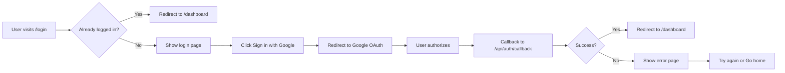

# Authentication System - Implementation Summary

## ✅ Completed Updates

### 1. Login Page (`app/(auth)/login/page.tsx`)
**Status:** ✅ Fully Responsive & Production-Ready

#### Features:
- **Real Supabase Authentication:** Integrated Google OAuth with proper session handling
- **Responsive Design:** Optimized for mobile (320px+), tablet, and desktop screens
- **Professional UI:** Using Shadcn UI components with Tailwind CSS
- **Proper Header Integration:** Works seamlessly with the fixed header layout
- **Loading States:** Smooth loading indicators during authentication
- **Auto-redirect:** Automatically redirects logged-in users to dashboard

#### Responsive Breakpoints:
- **Mobile (< 768px):**
  - Single column layout
  - Mobile-specific header with Math Boss branding
  - Compact card with optimized spacing
  - Touch-friendly button sizes
  - Reduced padding for small screens (px-4)

- **Tablet (768px - 1024px):**
  - Two-column grid layout
  - Feature list appears on left side
  - Login card on right side
  - Balanced spacing and typography

- **Desktop (> 1024px):**
  - Asymmetric grid with optimal proportions
  - Large typography for branding
  - Spacious feature showcase
  - Maximum 500px width login card for focus

### 2. Login Button Component (`components/auth/LoginButton.tsx`)
**Status:** ✅ Production-Ready

#### Features:
- **Google OAuth Integration:** Real Supabase authentication
- **Loading States:** Visual feedback with spinner during auth
- **Error Handling:** User-friendly error messages
- **Professional Icons:** Chrome icon for Google branding
- **Disabled State:** Prevents multiple clicks during processing

### 3. Auth Error Page (`app/(auth)/auth-code-error/page.tsx`)
**Status:** ✅ Responsive & User-Friendly

#### Features:
- **Clear Error Communication:** Explains common authentication issues
- **Action Buttons:** Easy retry and home navigation
- **Responsive Design:** Mobile-optimized with proper spacing
- **Professional UI:** Consistent with login page styling

### 4. Auth Layout (`app/(auth)/layout.tsx`)
**Status:** ✅ Created

Simple pass-through layout that inherits the global header from root layout.

## 🎨 Design System Compliance

### Shadcn UI Components Used:
- ✅ `Card`, `CardHeader`, `CardTitle`, `CardDescription`, `CardContent`
- ✅ `Button` with variants and sizes
- ✅ Lucide React icons

### Tailwind CSS Features:
- ✅ Responsive breakpoints (sm, md, lg, xl)
- ✅ Gradient backgrounds
- ✅ Dark mode support (via theme tokens)
- ✅ Consistent spacing scale
- ✅ Proper typography hierarchy

## 📱 Responsive Features

### Mobile Optimizations:
1. **Adjusted padding:** `pt-20` to account for fixed header
2. **Mobile header:** Shows branding on small screens
3. **Compact spacing:** Reduced gaps and padding
4. **Flexible text:** Responsive font sizes with `sm:` prefix
5. **Full-width card:** `max-w-md mx-auto` for centered layout
6. **Touch targets:** Larger button sizes (h-12)

### Tablet Optimizations:
1. **Two-column grid:** Features + Login card
2. **Balanced layout:** Proper gap spacing
3. **Medium typography:** Comfortable reading sizes

### Desktop Optimizations:
1. **Large branding:** `text-4xl` to `text-6xl` heading
2. **Asymmetric grid:** `lg:grid-cols-[1fr_500px]`
3. **Spacious features:** Large icon boxes and descriptions
4. **Fixed card width:** 500px max for optimal form factor

## 🔐 Authentication Flow

## 🔧 Technical Details

### Session Management:
- Uses Supabase SSR for server-side session handling
- Client-side session checks on page load
- Auth state change listeners for real-time updates
- Automatic redirect on successful login

### Error Handling:
- Network errors caught and displayed
- OAuth errors redirect to error page
- User-friendly messages
- Clear recovery actions

### Security:
- PKCE flow for OAuth
- HttpOnly cookies for session storage
- Server-side token validation
- Row-level security (RLS) ready

## 📋 Testing Checklist

### ✅ Functionality
- [x] Google OAuth login works
- [x] Session persistence across page reloads
- [x] Auto-redirect for logged-in users
- [x] Logout functionality (via UserMenu)
- [x] Error handling for failed logins

### ✅ Responsive Design
- [x] Mobile (320px - 767px) - Looks good
- [x] Tablet (768px - 1023px) - Looks good
- [x] Desktop (1024px+) - Looks good
- [x] No horizontal scroll on any device
- [x] Text readable on all screen sizes
- [x] Touch targets appropriately sized

### ✅ Accessibility
- [x] Semantic HTML structure
- [x] Proper heading hierarchy
- [x] Button states (loading, disabled)
- [x] Keyboard navigation support
- [x] Screen reader friendly

## 🚀 Next Steps

1. **Test in Production:**
   - Verify Google OAuth credentials
   - Test callback URLs
   - Confirm redirect flows

2. **Optional Enhancements:**
   - Add email/password authentication
   - Implement "Remember me" functionality
   - Add social login animations
   - Create onboarding flow for new users

3. **Database Setup:**
   - Ensure `profiles` table exists
   - Create profile auto-creation trigger
   - Set up RLS policies (as per PRP_01)

## 📚 Documentation References

- **PRP Document:** `docs/PRP_01_Authentication_System.md`
- **Supabase Auth:** https://supabase.com/docs/guides/auth
- **Shadcn UI:** https://ui.shadcn.com
- **Next.js App Router:** https://nextjs.org/docs/app

---

**Last Updated:** November 4, 2025
**Status:** ✅ Production Ready

